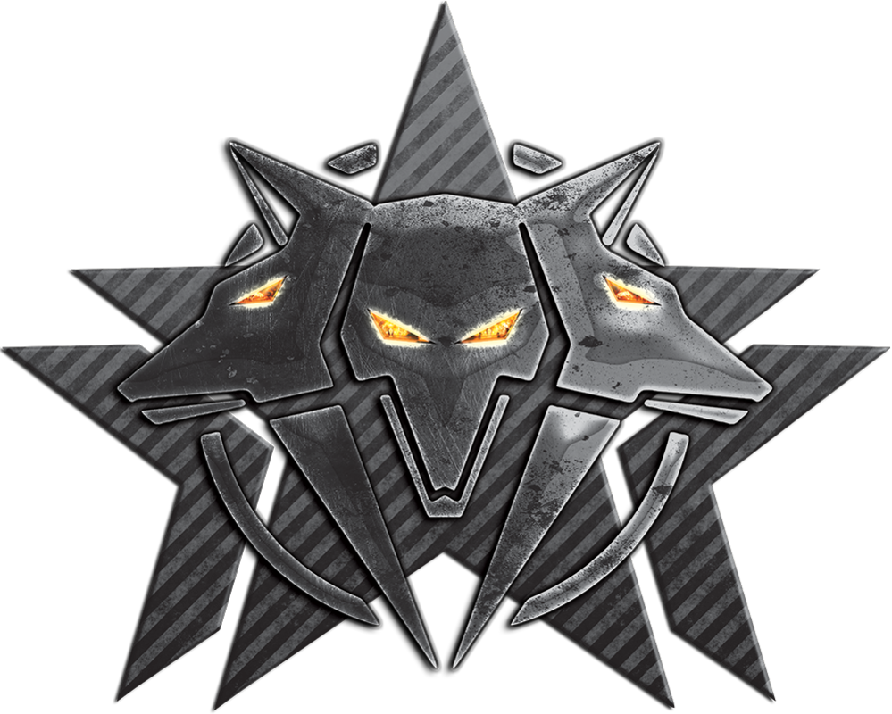

hackerspace to projekt mający na celu organizacje naszej pracy w utrzymaniu i doskonaleniu naszej wiedzy technicznej oraz umiejętności praktycznych w zakresie szeregu dziedzin, które stanowią dziś fundament funkcjonowania i rozwoju społeczeństwa. zakres naszej pracy

było by bardzo trudno wypisać tu wszystkie poszczególne tematy, pomocne może okazać się zapoznanie ze spisem zagadnień, który jest sukcesywnie rozwijany wraz z postępem migracji poprzedniego systemu organizacji dokumentacji. nasze serwisy

w spisie tematów znajdują się także odnośniki do naszego repozytorium kodu, systemu wyszukiwania informacji, systemu kursów, build serwera naszej dystrybucji systemu operacyjnego GNU/Linux BLUECORE-禅 (opartego o Gentoo Linux, a także inspirowanego pracą zespołu Pentoo i CLIP OS (system operacyjny stworzony przez ANSSI, Narodową Agencję Cyberbezpieczeństwa Francji)) oraz inne… serwisy zaufane podobnie jak CCC ( The Chaos Computer Club e. V. (CCC) is Europe’s largest association of hackers) oferujemy dostęp do usług za pomocą zabezpieczonych kanałów komunikacji aby ograniczyć prawdopodobieństwo naruszenia principia CIA (The CIA Triad - Confidentiality, Integrity, and Availability - is a guiding model in information security) oraz w celu integracji z zaprzyjaźnionymi serwisami.
